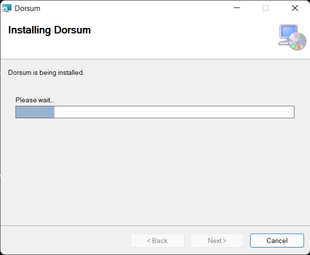

<h2>Dorsum<h2>
<h3>CRM windows app for car service and car wash</h3>
Stack:
<ul>
    <li>WPF</li>
    <li>MVVM pattern</li>
    <li>Entity Framework</li>
    <li>MySQL</li>
</ul>

<h1>Demo</h1>
<h2>Application</h2>

<h2>Installer</h2>

One of main goals of the project was to use non self-contained db (like SQLite) and to make installer simple. I had to write self-executable archive with bat script

